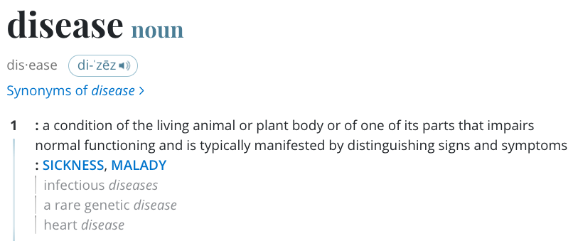
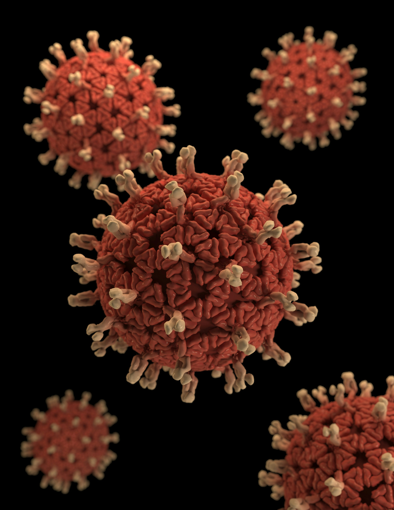
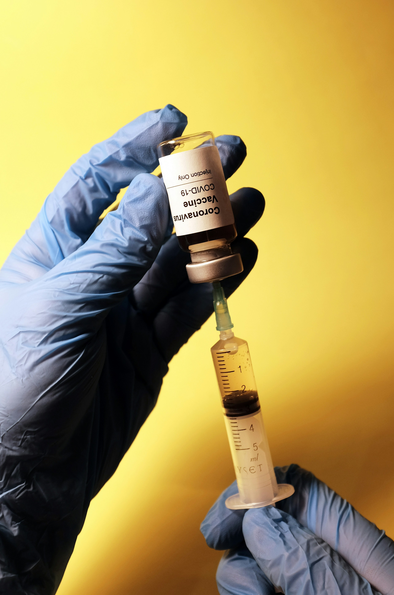
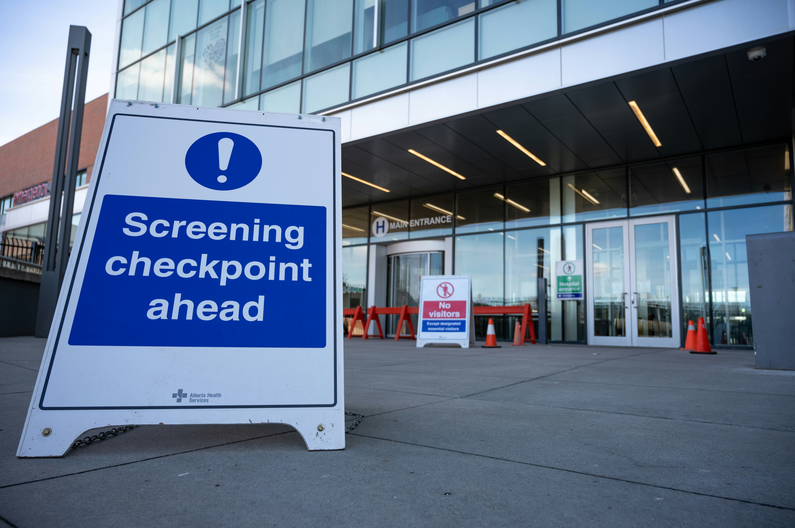

## What are infectious diseases

{fig-cap="Definition of a disease according to the Merriam Webster dictionary" fig-align="center"}

------------------------------------------------------------------------

::::: columns
::: {.column width="45%"}

:::

::: {.column width="55%"}
Diseases can be classified according to:

- [Cause]{style="color:tomato"} (e.g., infectious, non-infectious)
- [Duration]{style="color:tomato"} (e.g., acute, chronic)
- [Mode of transmission]{style="color:tomato"} (direct or indirect)
- [Impact]{style="color:tomato"} on the host (e.g., fatal, non-fatal)
:::
:::::

------------------------------------------------------------------------

Note that these classifications are not mutually exclusive. Hence, a disease can be classified under more than one category at a time.

------------------------------------------------------------------------

## How are infectious diseases controlled? {#sec-control-measures}

- In general, infectious disease control aims to reduce disease transmission.
- The type of control used depends on the disease and its characteristics.
- Broadly, there are two main types of control measures:
  - Pharmaceutical interventions (PIs)
  - Non-pharmaceutical interventions (NPIs)

------------------------------------------------------------------------

### Pharmaceutical interventions (PIs)

- Pharmaceutical Interventions are medical interventions that target the pathogen or the host.

- Examples:

  - Vaccines,
  - Antiviral drugs, and
  - Antibiotics.

------------------------------------------------------------------------

#### Vaccination {#sec-vaccination}

::::: columns
::: {.column width="40%"}

:::

::: {.column width="60%"}
- Activates the host's immune system to produce antibodies against the pathogen.
- Generally applied to reduce the risk of infection and disease.
- [The most effective way to prevent infectious diseases.]{style="color:tomato"}
:::
:::::

------------------------------------------------------------------------

##### Challenges with vaccination

- Take time to develop for new pathogens
- Never 100% effective and limited duration of protection
- Adverse side effects
- Some individuals cannot be vaccinated or refuse vaccination
- Some pathogens mutate rapidly (e.g., influenza virus)
- Logistical challenges (e.g., cold chain requirements)

------------------------------------------------------------------------

::: {.callout-caution collapse="true" icon="false"}
### Discussion

- Can you think of some challenges with the other pharmaceutical interventions (antivirals and antibiotics)?
:::

------------------------------------------------------------------------

### Non-pharmaceutical interventions (NPIs) {#sec-npi}

::::: columns
::: {.column width="50%"}
{width="70%"}

{width="70%"}
:::

::: {.column width="50%"}
- Non-pharmaceutical interventions are measures that [do not]{style="color:tomato"} involve medical interventions.

- Examples:

  - Quarantine & Isolation
  - Hygiene improvements
  - Safe and dignified burials
  - Physical distancing
  - Mask-wearing
:::
:::::

------------------------------------------------------------------------

#### Quarantine

- [Isolation of individuals who may have been exposed to a contagious disease.]{style="color:tomato"}
- Applies to [exposed but asymptomatic individuals]{style="color:tomato"} who may or may not be infected
- Advantage is that it's simple and its effectiveness does not depend on the disease.
- Disadvantages include:
  - Infringement on individual rights
  - Can be difficult to enforce
  - Can be costly
  - Can lead to social stigma

------------------------------------------------------------------------

#### Contact tracing

- [Contact tracing is used to identify exposed individuals, i.e., individuals who might been in contact with an infected/infectious individual.]{style="color:tomato"}
- It involves identifying, assessing, and managing people who have been exposed to a contagious disease to prevent further transmission.
- It is a [critical component of infectious disease surveillance]{style="color:tomato"} and is often used in combination with other control measures.

------------------------------------------------------------------------

::: {.callout-caution collapse="true" icon="false"}
### Discussion

- How can we quantify the impact of a control measure?
:::

------------------------------------------------------------------------

::: {.fragment style="font-size: 450%"}
Any Questions?
:::
