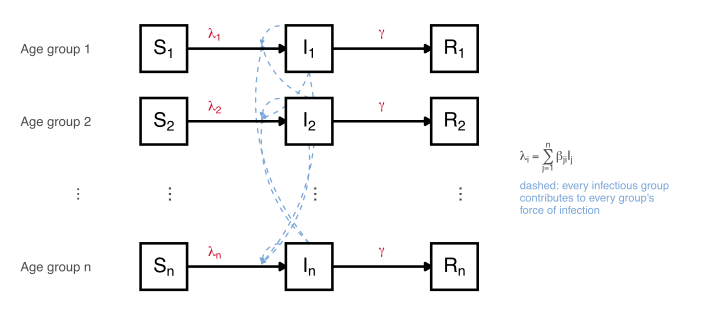
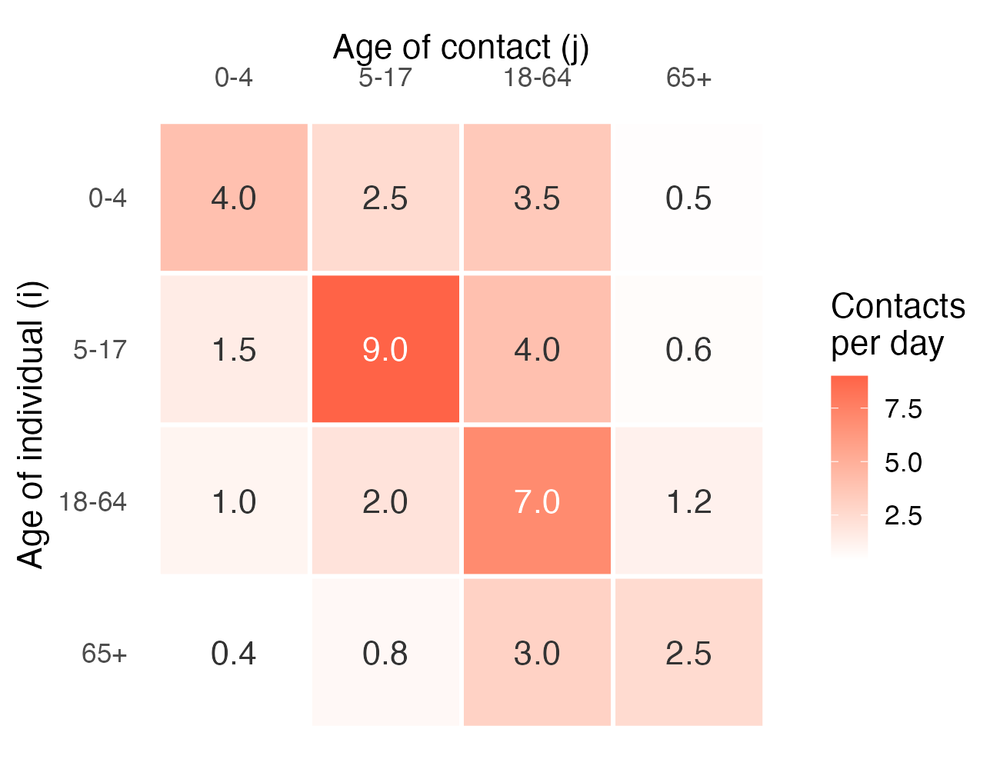

- The models we have discussed so far [assume that all individuals in the population are identical]{style="color:tomato"}.

- However, [in reality, individuals differ]{style="color:tomato"} in their susceptibility to infection and their ability to transmit the disease.

- It is essential to [capture this heterogeneity]{style="color:tomato"} in the models in order for the models to be more realistic and useful for decision-making.

------------------------------------------------------------------------

- This can be captured by incorporating heterogeneity into the models.

- Heterogeneity is often captured by [stratifying]{style="color:tomato"} the population into [different groups]{style="color:tomato"}.

------------------------------------------------------------------------

## Age structure

- For many infectious diseases, the risk of infection and the severity of the disease [vary by age]{style="color:tomato"}.

- Hence, it is essential to capture [age structure]{style="color:tomato"} in the models.

- To do this, we [divide the population into different age groups]{style="color:tomato"} and model the disease dynamics within each age group.

------------------------------------------------------------------------

- Let's extend the SIR model to include age structure.
- We will divide the population into [$n$ age groups]{style="color:tomato"}.
- Because the homogeneous model has 3 compartments, the age structured one will have $3n$ compartments: $S_1, I_1, R_1, S_2, I_2, R_2, ..., S_n, I_n, R_n$.

------------------------------------------------------------------------

::: {.content-visible unless-format="pdf"}
{width="95%" fig-align="center"}
:::

::: {.content-visible when-format="pdf"}
{width="95%" fig-align="center"}
:::

------------------------------------------------------------------------

::::: columns
::: {.column width="55%"}
::: {.content-visible unless-format="pdf"}
{width="100%"}
:::

::: {.content-visible when-format="pdf"}
{width="100%"}
:::
:::

::: {.column width="45%"}
- The (compact) model equations are as follows:

\begin{align*}
\dfrac{dS_i}{dt} &= -\sum_{j=1}^{n} \beta_{ji} S_i I_j \\
\dfrac{dI_i}{dt} &= \sum_{j=1}^{n} \beta_{ji} S_i I_j - \gamma I_i \\
\dfrac{dR_i}{dt} &= \gamma I_i
\end{align*}
:::
:::::

------------------------------------------------------------------------

### What is $\beta_{ji}$?

- [$\beta_{ji}$]{style="color:tomato"} is the rate at which [one infectious individual in group $j$]{style="color:tomato"} infects [a susceptible in group $i$]{style="color:tomato"}.
- As in the SIR model, it is a product of [contacts]{style="color:blue"} and [transmissibility]{style="color:blue"}: $\beta_{ji} = c_{ji} \times v$, where $c_{ji}$ is the rate at which individuals in $i$ come into contact with individuals in $j$, and $v$ is the probability of transmission per contact ($v$ can also vary by age).
- The force of infection on group $i$ adds up the contributions of [every]{style="color:tomato"} infectious group: $\lambda_i = \sum_{j=1}^{n} \beta_{ji} I_j$.

------------------------------------------------------------------------

- For $n = 2$ age groups, written out in full:

$$
\begin{pmatrix} \lambda_1 \\ \lambda_2 \end{pmatrix}
=
\begin{pmatrix} \beta_{11} & \beta_{21} \\ \beta_{12} & \beta_{22} \end{pmatrix}
\begin{pmatrix} I_1 \\ I_2 \end{pmatrix}
$$

- The $n \times n$ matrix of $\beta_{ji}$ is called the [who-acquires-infection-from-whom (WAIFW) matrix]{style="color:tomato"}.
- Its [diagonal]{style="color:blue"} is transmission within an age group; the [off-diagonal]{style="color:blue"} entries are transmission between age groups.
- The homogeneous SIR model is the special case where all $\beta_{ji}$ are equal.

------------------------------------------------------------------------

### Where do the $\beta_{ji}$ come from?

::::: columns
::: {.column width="55%"}
- Contact rates come from [contact surveys]{style="color:tomato"}: participants record who they met in a day, and their ages, e.g. POLYMOD [@mossong2008social]. The `socialmixr` R package provides many such surveys.
:::

::: {.column width="45%"}

:::
:::::

------------------------------------------------------------------------

::::: columns
::: {.column width="55%"}
- Mixing is [assortative]{style="color:tomato"}: most contacts are with people of a [similar age]{style="color:blue"}, plus a [parent--child]{style="color:blue"} band.
- Contacts are [reciprocal]{style="color:tomato"}: $c_{ji} N_i = c_{ij} N_j$, so the matrix is not free to take any shape.
:::

::: {.column width="45%"}

:::
:::::

------------------------------------------------------------------------

- The model can be used to study the impact of age structure on the dynamics of the epidemic.

- For example, we can study the impact of vaccinating different age groups on the dynamics of the epidemic.

------------------------------------------------------------------------

## Other Heterogeneities

- Other forms of heterogeneity that can be incorporated into the models include:
  - Spatial heterogeneity
  - Temporal heterogeneity
  - Contact heterogeneity
  - Heterogeneity in host behavior

------------------------------------------------------------------------

::: {.fragment style="font-size: 450%"}
Any Questions?
:::
