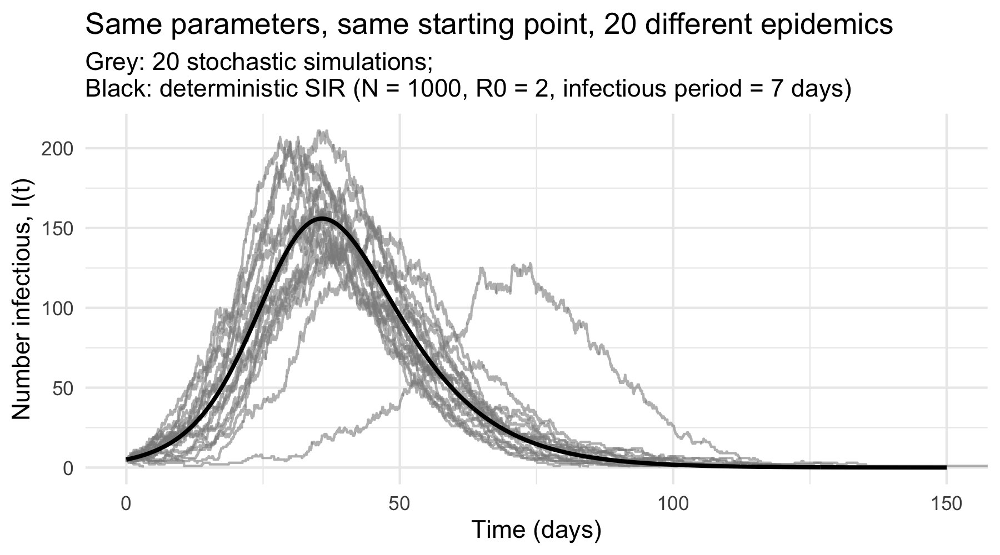
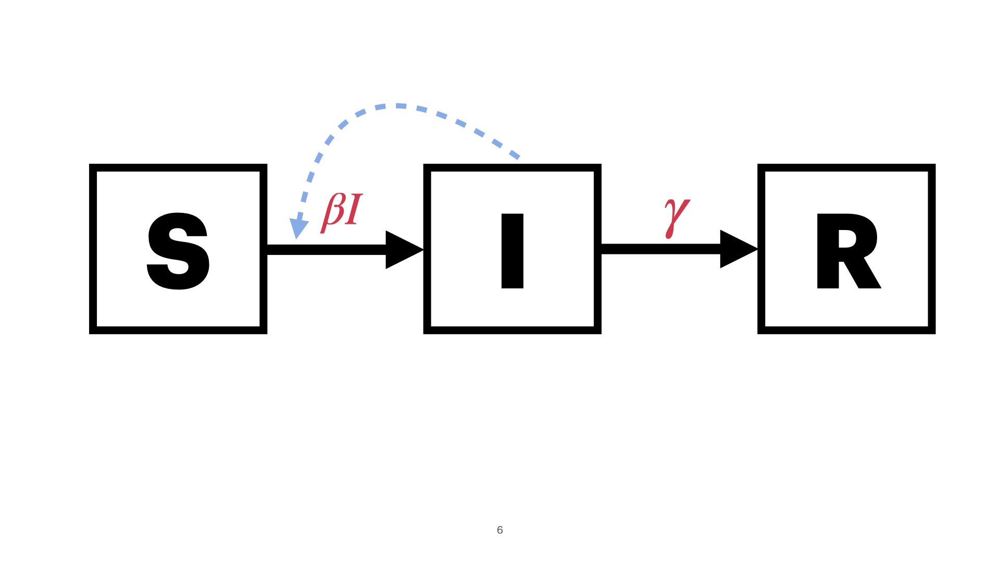
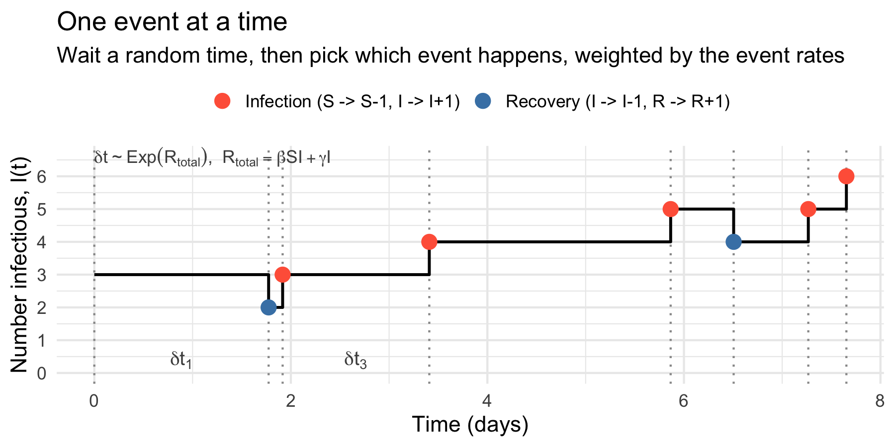

## Incorporating stochasticity

- The models so far are [deterministic]{style="color:tomato"}: given the same inputs, they always produce [exactly the same trajectory]{style="color:tomato"}.
- If we could "re-run" a real epidemic, we would [not]{style="color:tomato"} see the same people infected at the same times.
- There is an important element of [chance]{style="color:tomato"} in who meets whom, who gets infected, and who recovers when.

------------------------------------------------------------------------

{width="85%" fig-align="center"}

------------------------------------------------------------------------

### When does chance matter most?

Chance matters most when the [number of infectious individuals is small]{style="color:tomato"}:

- [Small populations]{style="color:blue"} (villages, hospital wards, schools, herds)
- [Early in an invasion]{style="color:blue"}: a handful of imported cases
- [After successful control]{style="color:blue"}: driving cases towards zero
- [Troughs]{style="color:blue"} between epidemic waves

------------------------------------------------------------------------

::: {.callout-caution collapse="true" icon="false"}
### Discussion

- Think of an outbreak you have worked on or read about. At which point would a deterministic SIR model have been [misleading]{style="color:blue"}?
:::

------------------------------------------------------------------------

## Three ways to add stochasticity to a model

| Approach | Idea | Best when |
|:-------------------|:---------------------------------|:-----------------|
| [Observational noise]{style="color:tomato"} | Dynamics stay deterministic; only the *reported* data are noisy | Interpreting case data |
| [Process noise]{style="color:tomato"} | Add a random term to the ODEs (a *stochastic differential equation*) | Populations are large |
| [Event-driven]{style="color:tomato"} | Count whole people; each infection and recovery is a [random event]{style="color:blue"} | Numbers are small |

------------------------------------------------------------------------

- Observational noise [does not change the dynamics]{style="color:tomato"}; the true number of cases still follows the deterministic model.
- Process noise is computationally cheap, but does [not respect the discrete nature of individuals]{style="color:tomato"}.
- Event-driven models are the [most popular]{style="color:tomato"} because they are mechanistic, individual-based, and are the natural way to capture [extinction]{style="color:blue"}.

------------------------------------------------------------------------

## Event-driven stochastic SIR

{width="40%" fig-align="center"}

- $S$, $I$, $R$ are now [integers]{style="color:tomato"} (whole people).
- The ODE terms become [event rates]{style="color:tomato"}

------------------------------------------------------------------------

{width="40%" fig-align="center"}

| Event                           | Rate        | Effect                       |
|:--------------|:--------------|:-----------------------------------------|
| [Infection]{style="color:blue"} | $\beta S I$ | $S \to S - 1,\; I \to I + 1$ |
| [Recovery]{style="color:blue"}  | $\gamma I$  | $I \to I - 1,\; R \to R + 1$ |

------------------------------------------------------------------------

- In a closed SIR model, these are the [only two events]{style="color:tomato"} that can happen.
- With births and deaths, we would add [four more]{style="color:blue"} (birth into $S$; death from $S$, $I$, or $R$), each with its own rate.
- The rates tell us [how often]{style="color:tomato"} each event happens on average; chance decides [exactly when]{style="color:tomato"} and [which one]{style="color:tomato"}.

------------------------------------------------------------------------

## Simulating one event at a time: Gillespie's direct method

- Proposed by @gillespie1977exact for chemical reactions; it is an [exact]{style="color:tomato"} simulation of the continuous-time stochastic process whose average behaviour is the ODE.

------------------------------------------------------------------------

1.  Compute the rates of all events: $r_{\text{inf}} = \beta S I$, $r_{\text{rec}} = \gamma I$, and their sum $R_{\text{total}} = r_{\text{inf}} + r_{\text{rec}}$.
2.  Draw the [time to the next event]{style="color:tomato"}: $\delta t \sim \text{Exponential}(R_{\text{total}})$, i.e. $\delta t = -\log(u_1)/R_{\text{total}}$ with $u_1 \sim \text{Uniform}(0, 1)$.
3.  Draw [which event]{style="color:tomato"} happens: infection with probability $r_{\text{inf}} / R_{\text{total}}$, otherwise recovery.
4.  Update $t \to t + \delta t$ and the compartments; repeat until $I = 0$ or $t > t_{\max}$.

------------------------------------------------------------------------

{width="85%" fig-align="center"}

------------------------------------------------------------------------

### Why an exponential waiting time?

- If events happen at a constant rate $R_{\text{total}}$, the number of events in a short interval is [Poisson]{style="color:tomato"} distributed.
- The [waiting time]{style="color:tomato"} until the next Poisson event is [exponentially distributed]{style="color:tomato"} with mean $1/R_{\text{total}}$.
- The exponential distribution is [memoryless]{style="color:blue"}: how long we have already waited tells us nothing about how much longer to wait.
  - This is the same assumption we made in the ODE: each infectious individual recovers at a constant rate $\gamma$, regardless of how long they have been infectious.

------------------------------------------------------------------------

### The algorithm in R

``` r
while (I > 0 && t < t_max) {
  rate_inf   <- beta * S * I
  rate_rec   <- gamma * I
  rate_total <- rate_inf + rate_rec
  dt <- rexp(1, rate = rate_total)  # time to next event
  if (runif(1) < rate_inf / rate_total) {  # which event?
    S <- S - 1; I <- I + 1  # infection
  } else {
    I <- I - 1; R <- R + 1  # recovery
  }
  t <- t + dt
}
```

- Store $t$, $S$, $I$, $R$ after every event and you have one simulated epidemic.

------------------------------------------------------------------------

### Alternatives you will come across

- [First-reaction method]{style="color:tomato"}: draw a waiting time for [every]{style="color:blue"} event and take the earliest. Easier to explain, mathematically equivalent, but [slower]{style="color:blue"}.
- [$\tau$-leap method]{style="color:tomato"}: fix a small time step $\delta t$ and draw the [number]{style="color:blue"} of infections and recoveries in that step from a Poisson distribution, e.g. `rpois(1, beta * S * I * dt)`.
  - Much [faster]{style="color:blue"} for large populations, but only [approximate]{style="color:blue"}: the step must be small enough that the rates barely change within it.

------------------------------------------------------------------------

::: {.callout-important icon="false"}
The number of events, and hence the run time, of Gillespie's method [grows with the population size]{style="color:tomato"}. For $N$ in the millions, use $\tau$-leaping.
:::

------------------------------------------------------------------------

## One run is not enough

- Each run is [one possible epidemic]{style="color:tomato"}. To say anything general we must run the model [many times]{style="color:tomato"} and summarise.
- Useful summaries:
  - The [mean]{style="color:blue"} trajectory (and how it compares with the ODE)
  - [Prediction intervals]{style="color:blue"}: e.g. the 2.5% and 97.5% quantiles of $I(t)$ across runs

------------------------------------------------------------------------

- Useful summaries:
  - The distribution of the [peak size]{style="color:blue"}, [peak timing]{style="color:blue"}, and [final size]{style="color:blue"}
  - The [probability]{style="color:blue"} of an event of interest, e.g. that the epidemic dies out

------------------------------------------------------------------------

## Summary

- Deterministic models describe the [average]{style="color:tomato"} epidemic; stochastic models describe the [range]{style="color:tomato"} of possible epidemics.
- Chance matters most when [numbers are small]{style="color:tomato"}: early in an outbreak, in small populations, and near elimination.
- The simplest stochastic SIR treats each infection and recovery as a [random event]{style="color:tomato"} with the rate given by the ODE; [Gillespie's algorithm]{style="color:tomato"} simulates it exactly.
- Always run [many simulations]{style="color:tomato"} and summarise.

------------------------------------------------------------------------

#### R Practicals

- Let's open the Quarto script [`sir_stochastic.qmd`](https://github.com/GWAC-MPPR/mppr_intro_to_idd_modelling_r_practicals/tree/main/model_implementation_practicals) and follow along.
- Download the file `Day 3 R practicals pack` from Moodle or clone it from GitHub using the following command in your terminal

``` bash
git clone \
https://github.com/GWAC-MPPR/mppr_intro_to_idd_modelling_r_practicals.git
```
